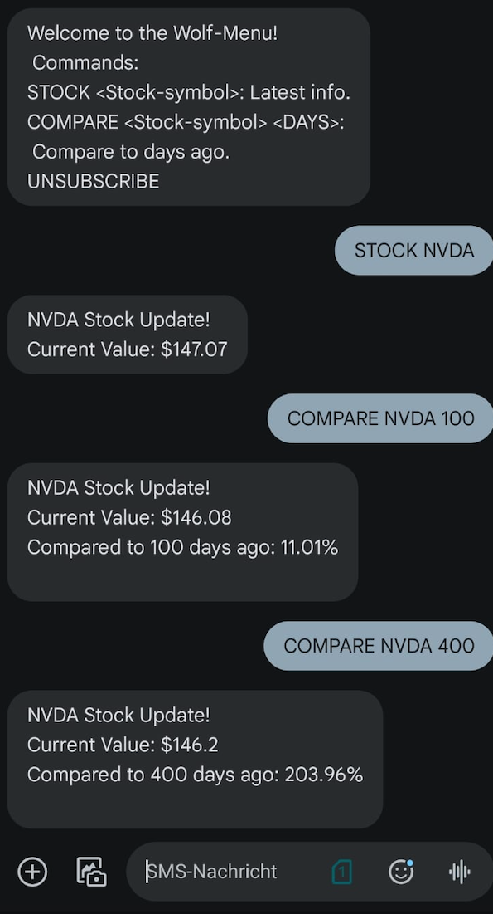

# SMS - Stock Alert Service

## Overview

The **SMS - Stock Alert Service** is a simple and fast solution for receiving real-time stock price updates via SMS. Designed to work on any mobile phone, including non-smartphones, it addresses key challenges such as:

- Limited internet access.
- Dependence on smartphones and data-heavy apps.
- The clutter of overwhelming notifications.

This service ensures accessibility and convenience for users who need quick stock updates without relying on constant internet connectivity.

---


## Key Features

- **Real-Time Updates:** Instant stock price details delivered via SMS.
- **Historical Comparison:** Compare stock prices with historical data.
- **Simple Commands:** Easy-to-use commands for stock updates.
- **Custom Alerts (Coming Soon):** Notifications for percentage changes and saved search histories.

---

## Example Commands

- `Stock AAPL`: Receive Apple’s stock details.
- `COMPARE AAPL 7`: Compare Apple’s stock price to its value over the past 7 days.
- `UNSUBSCRIBE`: Stop receiving updates.

---

## Why Use SMS - Stock Alert Service?

- **Retail Investors:** Get quick updates without dealing with app clutter.
- **Traders in Remote Areas:** Access stock updates even with limited or no internet.
- **Non-Smartphone Users:** Works on feature phones for ultimate accessibility.
- **Busy Professionals:** Instant notifications without the need for apps.

---

## How It Works

1. **Register:** Sign up for the service.
2. **Send SMS Commands:** For example, text `Stock AAPL` for Apple stock updates.
3. **Receive Updates:** Get instant stock details via SMS.
4. **Compare Values:** Use commands like `COMPARE AAPL 7` to analyze historical trends.

---

## Demonstration

Below is an example of how the service looks on a smartphone:


**Example Dialogue:**




---

## Quick Setup

1. Clone the repository:
   ```bash
    git clone https://github.com/saifmasterschool/allyoucaneat.git
   ```
2. Initialize the database:
   ```bash
   python3 db-setup.py
   ````
3. Manage users:
   `python usermgmt.py`
4. Install requirements:
   `pip install -r requirements.txt`
5. Start the service:
   `python main.py`

---

## Team: Wolves of Wall Street (WoWS)

Developed by:
- [@kaiser-data](https://github.com/kaiser-data)
- [@Marinaropc](https://github.com/Marinaropc)
- [@Suma-H](https://github.com/Suma-H)
- [@samypt](https://github.com/samypt)
- [@SenorGunter](https://github.com/SenorGunter)

Mentored by:
- [@saifmasterschool](https://github.com/saifmasterschool)

---

## Achievements

**1st Place Winner** - Masterschool Hackathon (January 2025)

---

## License

This project is licensed under the [MIT License](LICENSE).

---

Experience the simplicity and reliability of stock updates with **SMS - Stock Alert Service**!
